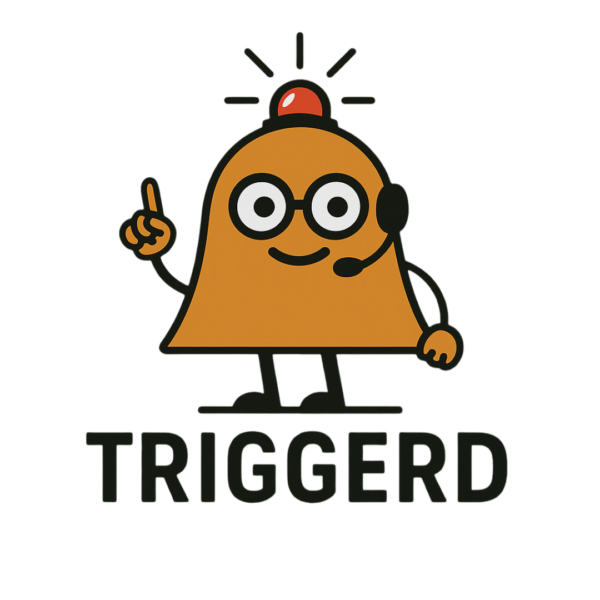

# NOTE: This project is in the beginning phase and anything can and will change. The following is a rough layout of the project objectives.

# Triggerd

<p align="center">
  
</p>


Meet **Triggerd**, your vigilant automation companion. 

Triggerd is a lightweight Go daemon that watches for triggers and reacts in real time by triggering an action. These actions could be shutting down an idle VM or waking it up, or executing custom shell commands. It’s programmable, pluggable, and built for DevOps tinkerers and infrastructure pros alike.

---

## ✨ Features

- 🧠 Rule-based engine: Define conditions like "low traffic for 5 minutes" and trigger actions.
- 🔍 Native pcap monitoring: Uses BPF filters for efficient packet capture.
- ⚙️ Action dispatch: Supports shell commands and libvirt VM control via `virt-go`.
- 🔁 Retry logic: Built-in retries with backoff for robust automation.
- 🔌 Extensible: Pluggable trigger and action system.

---

## 🐾 What Triggerd Watches For

> “If traffic on my home lab interface is idle for 5 minutes, shut down my VM. If traffic resumes, start it again.”

```yaml
rules:
  - name: "Shutdown on idle"
    trigger: "pcap"
    traffic_below: 1000
    idle_duration: "5m"
    action:
      type: "virt"
      operation: "shutdown"
      vm_name: "my-vm"
      uri: "qemu:///system"
      retries: 3
      retry_delay: "10s"

  - name: "Wake on traffic"
    trigger: "pcap"
    traffic_above: 5000
    idle_duration: "30s"
    action:
      type: "virt"
      operation: "start"
      vm_name: "my-vm"
      uri: "qemu:///system"
```
---

# Requirements
You need libpcap installed on your box, if you intend to use the pcap trigger.

---

# Development

A provided devcontainer is used that does contain all dependancies to build, run and test.

## Tasks

To use the tasks as described here we use [xc](https://xcfile.dev/)

### Test
Runs All Tests
```
go test ./...
```

### Build
Build Application add to output folder
```
mkdir -p output
go build -o output/dubvirt ./cmd/dupvirt
```

## Mascot Usage & Licensing

The Triggerd mascot, “Trigger,” is an original character created to represent the spirit of the project—vigilant, responsive, and infrastructure-savvy.

- © 2025 Wayne du Preez. All rights reserved.
- The mascot artwork is protected by copyright and may not be used in other projects, products, or branding without explicit permission.
- The name “Triggerd” and the mascot may be subject to trademark protection.

If you’d like to use the mascot in a blog post, article, or community project, please [open an issue](https://github.com/waynedupreez1/triggerd/issues) or contact the maintainers for permission.

> 🛡️ Respecting the mascot helps preserve the identity and integrity of the Triggerd project.

---

© 2025 Wayne du Preez. Triggerd and the Trigger mascot are trademarks or registered trademarks of Wayne du Preez.

